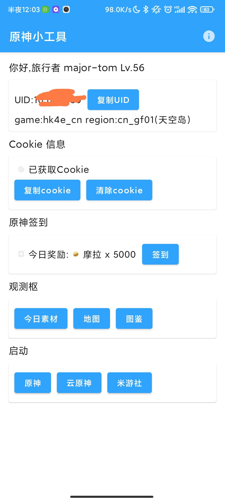

# 原神小工具

功能
=======
* 原神签到
* 便签小组件

截图
=======

API来源
=======
<https://gitee.com/muuuj1an/GenshinTools>

<https://github.com/spencerwooo/PaimonMenuBar>

<https://github.com/sirodeneko/genshin-sign>

License
=======
[MIT License](LICENSE)